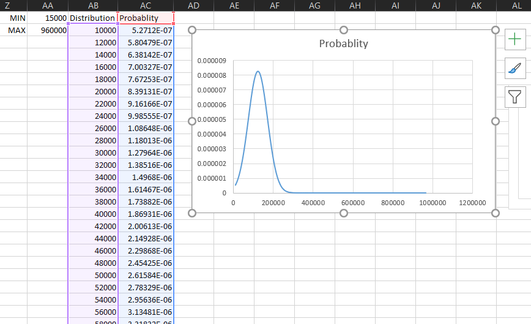

# Salary-Distribution-Analysis-Excel
An Excel-based analysis of salary data using statistical functions (mean, median, standard deviation, quartiles) and visualization through a normal distribution (bell curve).

## 🧠 Problem
I wanted to understand how salary data is distributed and whether most values are concentrated around a specific range or spread out.

---

## 📂 Dataset
Used a dataset containing salary values across different roles and time periods to explore patterns in the data.

---

## 🛠 Approach
- Calculated key statistical measures:
  - Mean (Average)
  - Median
  - Standard Deviation
  - Min, Max
  - Quartiles using `QUARTILE.INC`
- Generated a smooth range of values (X-axis) to model the distribution
- Used `NORM.DIST` to calculate probability values
- Built a bell curve (normal distribution) in Excel

---

## 📚 Concepts Applied (Simple Understanding)

- **Mean (Average)** → overall average, but can be affected by extreme values (outliers), unlike median  
- **Median** → middle value, more stable when outliers exist  
- **Standard Deviation** → shows how spread out the data is from the average  
- **Normal Distribution** → natural pattern where most values lie in the center  
- **Bell Curve** → visual representation of this distribution  
- **NORM.DIST** → Excel function used to generate the curve  
- **Outliers** → extreme values that differ significantly from the majority  
- **Data Spread** → how wide or narrow the distribution is  

---

## 📈 Key Insights

- Most salary values are concentrated around the average range  
- Very high salary values are less frequent, indicating possible outliers  
- The dataset shows a near bell-shaped distribution, suggesting a natural spread of values  

---
## 📸 Output

## 🎯 Learning

This project helped me move beyond just using Excel formulas to actually understanding how data behaves. It also showed how statistical concepts can be used to visualize and interpret real-world datasets.
